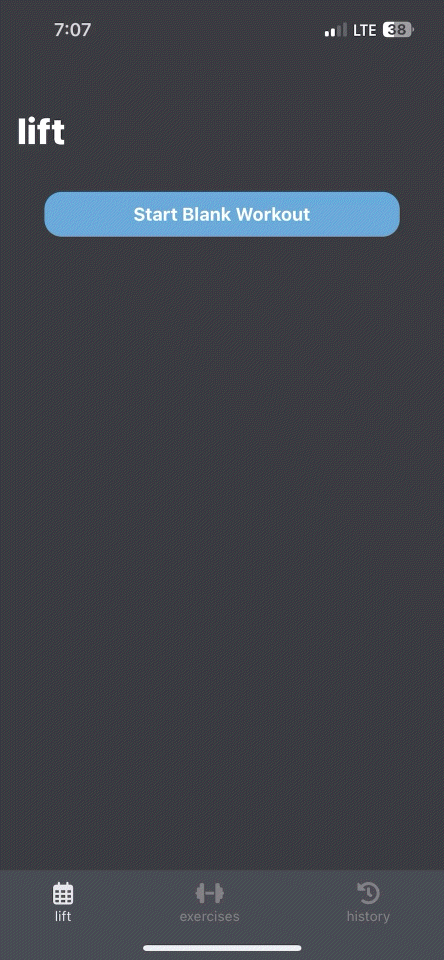
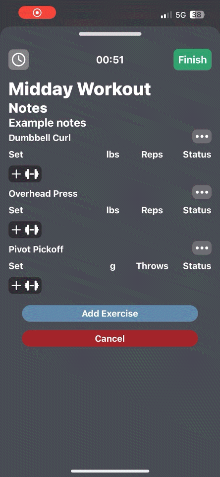
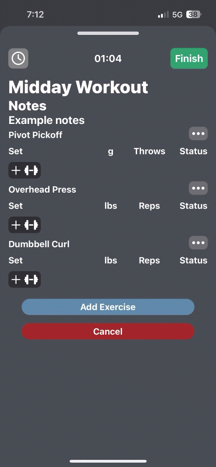
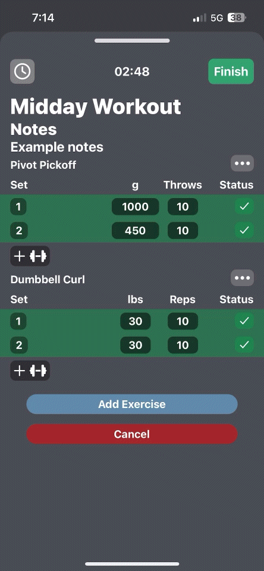

# lift


[](https://github.com/antpie530/lift/actions/workflows/node.js.yml)

lift is a native app for creating, tracking, and analyzing training programs.

## Table of Contents
- [Features](#features)
- [Installation](#installation)
- [Usage (GIFS)](#usage)
- [Conclusion](#conclusion)

## Features

- **Create Exercises**: Easily create exercises with customizable schema types. Add details such as name, description, and specific schemas tailored to each exercise.
- **Data Visualization**: Analyze your workout data with charts and graphs for a clearer understanding of your progress.
- **Smart Exercise Search**: Quickly find exercises using a smart search feature.
- **Create Workouts**: Build and manage workout routines. Each workout tracks the total time spent and logs sets for each exercise.
- **Set Management**: User-friendly interface for adding, editing, and removing sets during a workout.
- **Workout History**: After completing a workout, access your past workout history with a detailed summary of each session.
- **Edit Past Workouts**: Review and edit any workout from your history with a simple click.

### Upcoming Features

- **Workout Templates**: Create reusable workout templates for easy planning.
- **Training Programs**: Design entire training programs to follow over time.

## Installation
To install the project, follow these steps:
1. **Clone the Repository**  
First, clone the project from the GitHub repository: 
 
```
git clone https://github.com/antpie530/lift.git
```
2. **Navigate to the Project Directory**  
Move into the project folder:

```
cd lift
```
3. **Install Dependencies**  
Install the dependencies:
```
npm i
```
4. **Install the Expo Go App**  
Download and install the Expo Go app on your mobile device. You can find it on the [App Store](https://apps.apple.com/us/app/expo-go/id982107779) or [Google Play Store](https://play.google.com/store/apps/details?id=host.exp.exponent&hl=en_US&pli=1).

5. **Run the App**  
There are two ways to run the app, depending on your network setup:  
- Same Network:
If both your development machine and mobile device are on the same network, run:  
```
npx expo start
```  
- Different Networks:
If your devices are on different networks, run:
```
npx expo start --tunnel
```
6. Scan the QR Code  
Once the project is running, scan the QR code displayed in your terminal using the Expo Go app. This will download the project to your device, allowing you to start using the app.

## Usage
- **Create an Exercise**  
   Easily create new exercises by adding the name, description, and selecting the schema type.
   <div style="text-align: center">
   
   </div>
- **Search for Exercises**  
   Use the smart search feature to quickly find exercises.  
   <div style="text-align: center">
   
   </div>

- **Create a Workout**  
   Build and manage your workout routine by adding exercises and tracking progress.  
   <div style="text-align: center">
   
   </div>
- **Add Sets**  
   Add sets to workouts to track every exercise.
   <div style="text-align: center">
   
   </div>
- **Edit Workout Name and Notes**  
   Edit the workout name and notes to track unique events of every workout.
   <div style="text-align: center">
   
   </div>
- **Reorder Your Exercises**  
   Move your exercises to the same order that they were performed.
   <div style="text-align: center">
   
   </div>
- **Remove an Exercises**  
   Remove exercises that you no longer need.
   <div style="text-align: center">
   
   </div>
- **Set Validation**  
   Make sure your data is clean with validation. Get feedback whether your data is correct.
   <div style="text-align: center">
   
   </div>
   <div style="text-align: center">
   
   </div>
- **Submission Summary**  
   Get quick summary of the workout upon completion.
   <div style="text-align: center">
   
   </div>

- **View Workout History**  
   After finishing a workout, review your past workouts and see a summary of your performance.
   <div style="text-align: center">
   
   </div>
- **Edit Past Workouts**  
   If there were any mistakes, you can go back and edit your workout to match reality.
   <div style="text-align: center">
   
   </div>

## Conclusion
Thank you for your interest in the app. I hope it helps you create, track, and analyze your workouts efficiently with ease.

Happy lifting!
